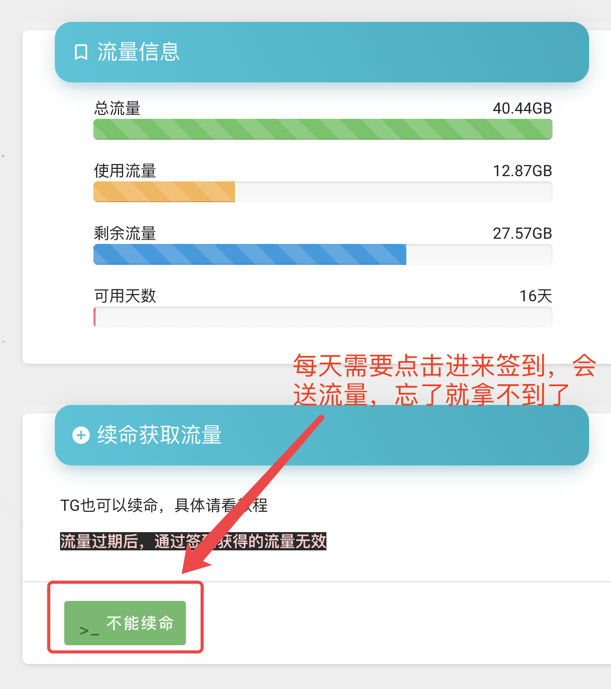
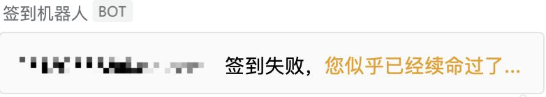

# sockboom签到

一个不错的机场，节点很稳定
> https://sockboom.tv

我的推广链接
> https://sockboom.shop/auth/register?affid=323288
## 项目功能
每天10点执行自动签到获取流量，不需要每天打开网站进行签到

## 使用方法
### fork

在项目 `settings => secrets` 添加 `SOCKBOOM_URL`, `SOCKBOOM_PASSWD`, , `SOCKBOOM_USER`字段，设置值依次为`SOCKBOOM域名`，`SOCKBOOM用户名`，`SOCKBOOM密码`，设置好可以手动触发一次，验证是否正确，下次就会定时触发了，再也不用担心签到了。
`WEB_HOOK`为企业微信机器人的地址，设置了成功失败会有提醒，如没有可以不需要设置
